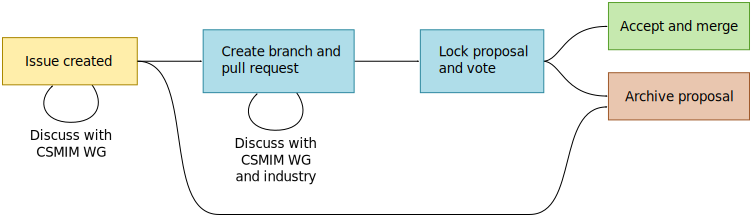

# How to contribute to CSMIM

Would you like to see an interface standardized as a CSMIM object type?
Or do you wish to enhance or change an existing type?

- **Search for existing CSMIM object types first** before requesting to
  create a new one.

- **Search the issues for existing discussions of your request.** Contribute
  to an existing discussion if possible, instead of opening a new issue.

- **Open an issue, describe your requirements and label it an enhancement.**
  If there are existing object types similar to what you need, mention them
  and explain what is missing for you and how the type should be enhanced.
  Note that we cannot change types once they are standardized, we can only
  replace them by newer types, with backwards-compatibility if possible.

Do you have a very concrete proposal for an object type?

- **Open an issue anyways** and describe your requirements instead of directly
  proposing an object type YAML, because we will have to discuss the rationale
  of the object type's details in any case.

Thank you for your efforts that will help to improve the CSMIM standard!

## How is your contribution processed?

1. The CSMIM working group discusses new issues internally and publicly on
   Github with you. This serves to get a better understanding of your
   requirements.

2. If new object types are proposed as a result from the discussion, work will
   be done in a dedicated branch and pull request, which is linked to the issue.
   We will attempt to gather more industry experts for the topic at hand, in
   order to reach a good consensus on the proposed interface.

3. If sufficient discussions have taken place and all comments are resolved,
   the proposal is locked and voted on by the CSMIM working group.

4. If enough votes were in favor of the proposal, the new object types are
   accepted into the standard. We merge the pull request into the main branch.

5. If the proposed object types are rejected, we archive the pull request and
   associated discussions for later reference. Given enough interest, the
   topic can be revived in the future.
