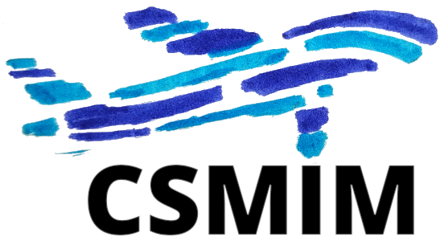

<!-- <h1 align="center">The ARINC 853 "CSMIM" Knowledge Base</h1> -->

  

Welcome to the **ARINC 853 Knowledge Base** for the "Cabin Secure Media-Independent Messaging" Protocol.
This repository contains standardized interface descriptions for aircraft cabin equipment.
Here, the aerospace industry collaborates to shape the cabin network of the future.

## Introduction

This repository complements the [ARINC 853 "CSMIM" standard](https://aviation-ia.sae-itc.com/standards/arinc853-853-cabin-secure-media-independent-messaging-csmim-protocol).
ARINC 853 specifies a modern
communication protocol for non-essential cabin equipment. The protocol specification draws
from related standards in the building and home automation domain, including
[MQTT](https://mqtt.org/) and [CBOR](https://cbor.io/) as building blocks. Whereas the
ARINC 853 document describes the generic protocol and data structure, this
repository &ndash; the CSMIM Knowledge Base &ndash; contains concrete interface definitions for
various cabin equipment. These definitions are considered "standard" and should be used
by all cabin equipment suppliers as far as possible.

The goal of our activities is to enable interoperability of all cabin equipment on all
types of aircraft, and to create an open aircraft cabin network where any supplier can
add new, useful functions.

## How to get started

You should have a basic understanding of the ARINC 853 standard itself, in particular of its
chapter 6.2 which describes the CSMIM abstract data model. This repository primarily contains
a list of standardized *CSMIM object types*, which are specified in ARINC 853 §6.2.7. The
object types are located in the [types/ folder](types/) as files in
[YAML](https://en.wikipedia.org/wiki/YAML) format.

- **If you search for object types:**
  Use the "Go to file" search box and input the object type
  identifier or simply phrases of interest. For example, input "light" to find object types
  concerned with cabin lighting. The search results will include the types
  (`types/csmim.obj.*.yaml`) plus all potential locations for objects instantiated from
  these types (`path/.../csmim.obj.*.yaml`).

- **If you could not find an object type matching your requirements:**
  Try searching the [issues](https://github.com/ARINC-IA/CSMIM/issues) for your requirements.
  Maybe someone is already working on your topic, and you can join an existing discussion.
  If the topic is new: Create an issue, describe your requirements and label it a "question".

- **If you want to propose a new object type or enhance an existing one:**
  Create an issue, describe your requirements and label it an "enhancement". If there are
  existing object types similar to what you need, mention them and explain what is
  missing for you and how the type should be enhanced.

- **If you want to publish manufacturer-specific extensions:**
  To publish your manufacturer-specific object types, fork this repository and add your
  manufacturer-specific definitions there. Make sure not to change any existing type.
  Always create new files. Add your manufacturer code to the object type identifier as
  required by the CSMIM standard. Derive from standard types wherever possible.

## Who maintains this repository?

This repository is owned by SAE ITC, the organization behind ARINC. The repository is managed
by the members of *CSMIM working group*, which belongs to the
[ARINC Cabin Systems Subcommittee](https://aviation-ia.sae-itc.com/subcommittees/cabin-systems-subcommittee).
Every ARINC member company can become active in the Cabin Systems Subcommittee and join the
CSMIM working group.
